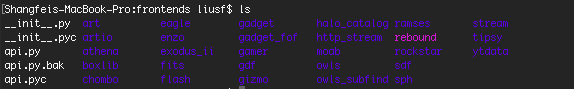
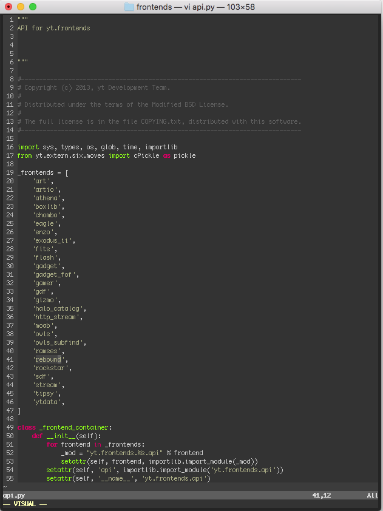
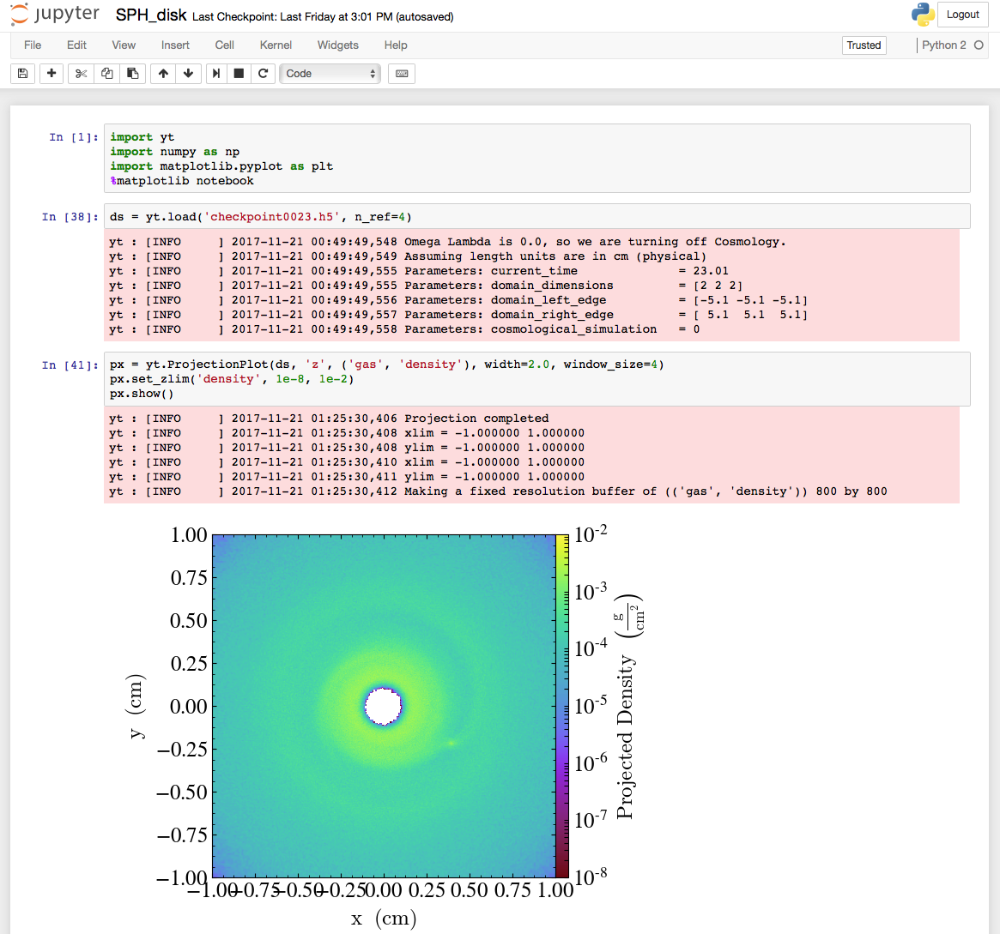

# REBOUND-SPH Frontend for yt

## Prerequisite 
* yt installed
* REBOUND-SPH with HDF5 output enabled (you will get files like checkpoint_0000.h5 under your working directory)

## How to hack into yt to make it support REBOUND-SPH
If you have installed yt using anaconda like me, you should find yt is being installed under the directory like /anaconda/lib/python2.7/site-packages/yt/. Find your yt installation path, and cd into it.

The data formats that yt supports are all under the frontends directory. Now checkout my repository, rename it to rebound, and place it under frontends. Your frontends directory should look like

You could also place REBOUND-SPH frontend at a different place, and create a symbolic link under the frontends directory.

The next step is let yt know you have installed a new frontend. Open the api.py under the frontends directory, and add one line
`'rebound',`
in the _frontends list. Your api.py should like this.

Now you can read HDF5 output of REBOUND-SPH in a Jupyter notebook like a magic.

